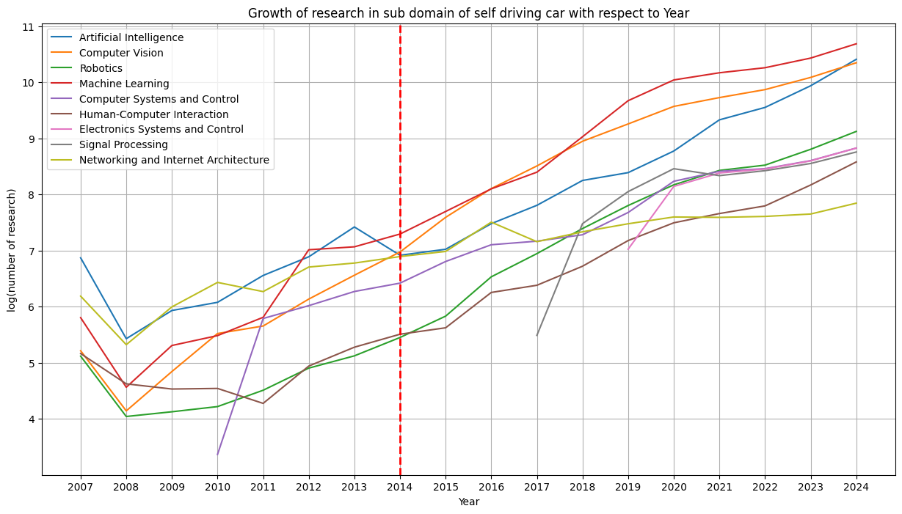
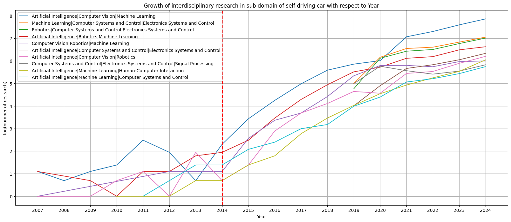
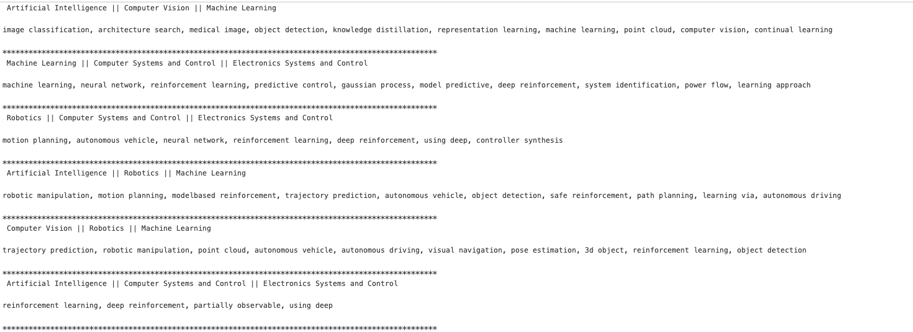
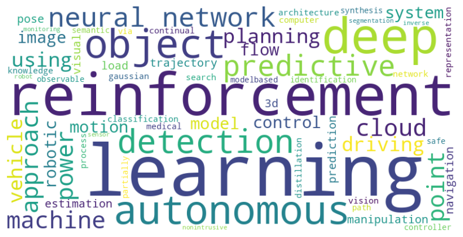

# Extracting Hot Trending Topics from Research Abstracts

This project presents a data-driven framework to identify emerging research trends across scientific domains by analyzing large-scale abstract data. Implemented in a single Jupyter notebook, the methodology combines time-aware frequency analysis, growth factor computation, and graph-based domain modeling to uncover hot topics and shifts in research priorities.

---

## 📌 Project Highlights

- **Goal**: Discover trending and emerging research areas by analyzing abstracts
- **Techniques**: TF-IDF, Word Embeddings, N-gram extraction, Growth Factor Analysis
- **Temporal Focus**: Trends over a 10-year window
- **Graph Modeling**: To explore interconnected domains

---

## Tools & Technologies

- Python
- Pandas
- Scikit-learn
- TF-IDF
- N-grams
- Word Embeddings
- NetworkX / Graph modeling 

---

## 📈 Methodology

### 1. **Temporal Word Frequency Analysis**

- Extract top N-grams and keywords per year
- Analyze their frequency evolution over time

### 2. **Growth Factor Computation**

- Define a custom **Growth Factor** metric
- Select trending topics based on growth over a 10-year sliding window

### 3. **Subdomain Trend Analysis**

- For instance: In the study subdomain of self driving car growth of `Computer System and Controls` and `Human-Computer Interaction` shows the emerging field  of of hardware , software and Human interaction with machines

### 4. **Interconnected Domain Analysis**

- Model domains (e.g., Robotics, Control Systems, Electronics) as a graph
- Identify clusters and cross-domain trend growth.

---

## Use Case: Self-Driving Car Domain
The framework was applied to analyze research abstracts related to autonomous vehicles. Key findings include:

| Subfield                                                | Trend         |
| ------------------------------------------------------- | ------------- |
| Artificial Intelligence & Computer Vision               | Steady Growth |
| Robotics                                                | Surge         |
| Human-Computer Interaction & Computer Systems & Control | Emerging      |

---

## Analysis

**Summary**
- All subdomain of self driving car is rising
- Research under AI, Computer Vision and Machine Learning was growing even before last 10 years
- Domain like Robotics catchup with other domains like AI and Computer Vision after a while
- Growth of `Computer System and Controls` and `Human-Computer Interaction` shows the emerging field  of of hardware , software and Human interaction with machines

    

**Summary**
- interelated study of `AI, ML and Human Computer Interaction` and `AI, ML and Control system` study show  shows a significant rise which is major indicator of usage and development of self driving car
- Another intersection of `AI, Computer Vision and Robotics` show there is significant growth in this area

    

**Summary**
- We can see there is some emerging topics in field of `Artificial Intelligence || Computer Vision || Machine Learning` like `image classification, architecture search, medical image, object detection`

- Some Topics like `power system, sensor network, power flow, load monitoring` under Computer Systems and Control || Electronics Systems and Control || Signal Processing shows more optimization is required in term of sensor network, power system.

- Topics came out from Artificial Intelligence || Computer Vision || Robotics shows following core field is still under the research category they yet have to time reach saturation under this categories. object detection, autonomous driving, semantic segmentation, 3d object, point cloud, pose estimation, reinforcement learning, visual navigation, robot learning, deep learning

    

**Common List of all some Trending topics from different multidisciplinary domain**

object detection, knowledge distillation, point cloud, predictive control, gaussian process, deep reinforcement,  power flow, learning approach, `motion planning`,  reinforcement learning, deep reinforcement,`robotic manipulation`, model based reinforcement, `trajectory prediction`, autonomous vehicle, safe reinforcement, `path planning`, learning via, autonomous driving, `visual navigation`, `pose estimation`, `3d object`,power system, `sensor network`, power flow, `load monitoring`,predictive control

---

## 💡 Applications

- Helps **researchers** identify emerging areas
- Assists **policy makers** and **industry leaders** in strategic decision-making
- Useful in **academic portfolio analysis** and **funding allocation**

---

## 🏁 License

This project is licensed under the MIT License.

